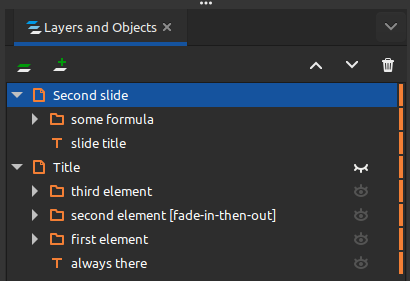
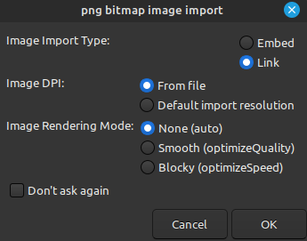

# InkReveal

## Installation

I recommend using the latest version of Inkscape: https://inkscape.org/release/inkscape-1.2.2/

To install the extension:
First, locate the extension folder of Inkscape via **Edit ‣ Preferences ‣ System: User extensions**.
Then, copy this repository into the extension folder and restart Inkscape.
(One linux, this might be done via `cd ~/.config/inkscape/extensions` and `git clone https://github.com/SteffenPL`.)

The extension is installed if the `Save as...` options include the type `Reveal.js presentation (*.html)`

## Usage

To create a presentation out of your current file, save your document as a `Reveal.js presentation (*.html)`.

This will create a `.html` file that contains a [reveal.js](https://revealjs.com/) presentation created from the layers of your document.

### Generation of slides

The rules for generating a slide are relatively simple:
> Each top-level layer represents a new slide. In addition, each direct sublayer or subgroup of the 
> the document represents an element that will appear one after the other. See the folder `examples` for an example presentation.

Take the following as an example:


This will generate a presentation with two slides (first Title and then Second slide). The title slide has one element which is always visible and three element which appear.

#### Extra options for appearing elements

Each sublayer of the top-level layers is treated as a `fragment` of a slide.
One can add special options to a fragement by adding a suffix to the layer name
inside `[` `]` brackets. For example `[fade-in-then-out]` in the screenshot above.

For a list of available options, see: https://revealjs.com/fragments/

### Images

When embedding images, use the option `link` instead of `embed`. 


The images will be copied into the folder `reveal.js-master/images` so that the presentation can be viewed on other devices as well.

The option `embed` would also work, but results in a much larger file size.

### $\LaTeX$ 

To use $\LaTeX$ in your presentation, you can use the `Textext` extension: https://textext.github.io/textext/

See also: [Create textext shortcut](https://textext.github.io/textext/usage/faq.html?highlight=shortcut#defining-keyboard-shortcut-for-opening-textext-dialog) for a more convenient access of the extension.

By using custom `.tex` templates one can match the latex fonts exactly to the inkscape. This is the template I use:
```latex
\documentclass[32pt]{scrartcl}

\usepackage{geometry}
\geometry{papersize={100cm,30cm}, left=20mm, top=20mm,}
 
\usepackage[bitstream-charter]{mathdesign}
\usepackage[T1]{fontenc}

\usepackage{fontspec}
\setmainfont{Ubuntu}

\let\circledS\undefined
\usepackage{amsmath,amsthm,amssymb,amsfonts}
\usepackage{nicefrac,stackrel,mathtools,bm}

\newcommand{\RR}{\mathbb{R}}
\newcommand{\Bf}[1]{\boldsymbol{#1}}
\newcommand{\Rm}[1]{\mathrm{#1}}
```

### Custom CSS and Reveal.js options

One can copy the file `slides_template.html`. An html template
only needs to have the following lines as a placeholder for the slides:
```html
    <div class="reveal">
        <div class="slides" id="inkscape-slides">				
        </div>
    </div>
```
